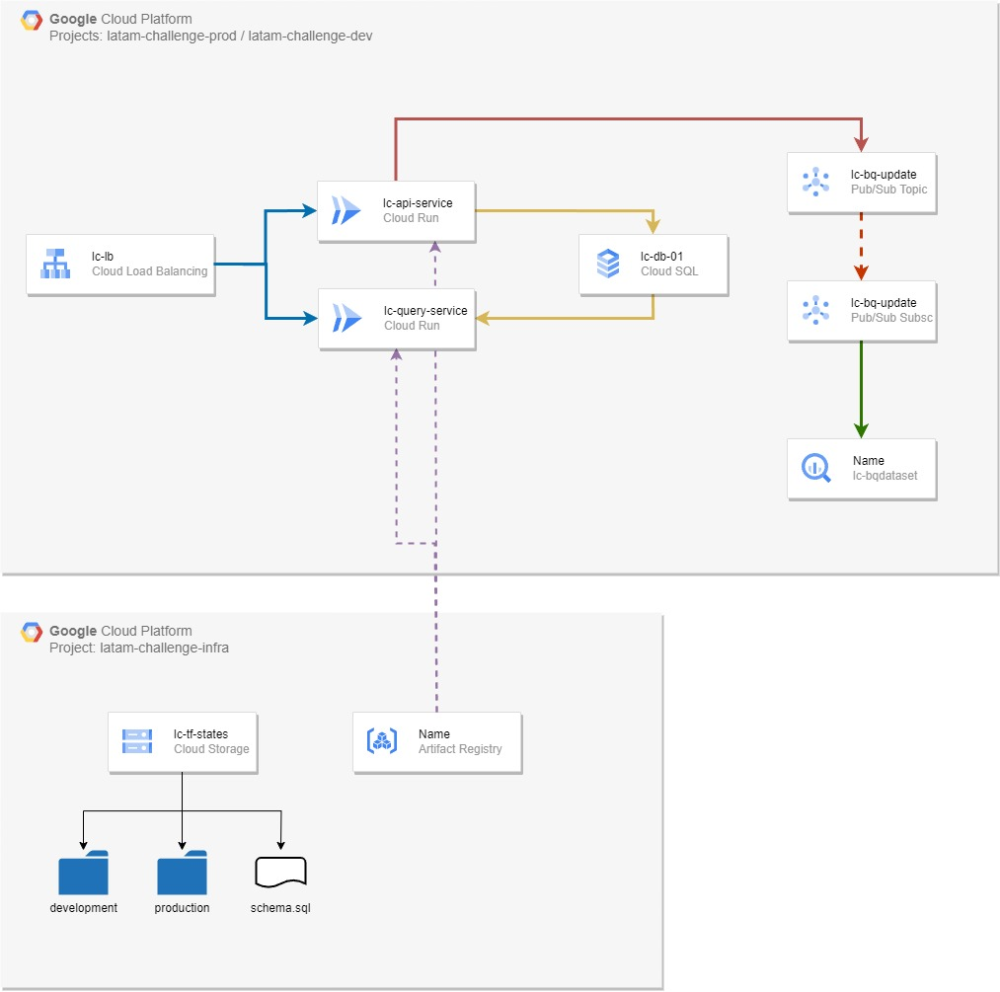

# LATAM Airlines DevSecOps Challenge
### _Ismael Ull_
A continuación se detallan los diferentes componentes de la soculión imlpementada. Cabe destacar que algunas conifiguraciones pueden ser mejoradas pero, por cuestiones de tiempo, se ha optado por realizarlas de manera genérica teniendo en cuenta que es una demo. en cada caso habrá un apartado denominado **TO-DO** el cual indicará las recomendaciones para seguir las buenas prácticas y pensar en un ambiente productivo real.

## Parte 1: Infraestructura

El sistema cuenta de dos microservicios los cuales son para ingesta y consulta de datos independientemente. Ambos utilizan una base de datos ***Mysql*** de ***CloudSQL*** para grabar y consultar los datos debido al balance entre calidad y precio del mismo buscando un servicio gestionado que permita escalabilidad.

El mismo endpoint que recibe los datos y los graba en la base de datos tambièn los publica en un tópico de Pub Sub para que los mismos sean almacenados en ***BigQuery*** para su posterior análisis.
Dependiendo los requerimientos es posible modificar este comportamiento para exportar a BQ una vez al día, por ejemplo, si se desea tener mas control sobre los costos o los análisis no requieren tener datos actualizados al instante.

Tanto el bucket para los estados como el repositorio para las imágenes Docker (almacenados en ***Artifact Registry***) se implementan en un proyecto separado llamado _latam-challenge-infra_ con la finalidad de centralizar los servicios que son horizontales a la solución y que podrían ser compartidos por mas de una app.

En lo posible se crean *Service Accounts* específicas para cada servicio con los permisos necesarios (siguiendo el principio del menor privilegio).

### IaC

Se utiliza Terraform para gestionar la infraestructura para facilitar el versionado y trabajo colaborativo del equipo de ingenieros ***Cloud*** y ***DevOps***. Los archivos declarativos se almacenan junto al código de la aplicación en ***GitHub*** y los estados (inicialmente de Desarrollo y Produccion) se almacenan en un bucket especìfico para tal fin y con la seguridad adecuada.

**TO-DO:**
- Utilizar ***Terragrunt*** para unificar la configuración de los ambientes sin perder la personalización de variables.
- Configurar _Service Account impersonation_ para poder trabajar con ***Terraform*** y ***Terragrunt*** sin la necesidad de distribución de keys.
- Dar un nivel más de segregación de los estados de ***Terraform***. Actualmente solo se separan **PROD** y **DEV**, pero se recomienda ahondar un nivel mas logrando separar los servicios para optimizar los tiempos de despliegue y minimizar la complejidad, por ejemplo teniendo diferentes state files para *Cómputo* (los servicios de ***CloudRun***), base de datos (***CloudSQL*** y ***BigQuery***), seguridad (cuentas de servicio y bindings de roles) y ***PubSub***.

### Endpoints
Como se indicó anteriormente, si pensamos en una solución a gran escala donde intervienen dos equipos de desarrollo con distintos niveles de actualización de código es recomendable separar los endpoints en servicios distintos permitiendo además que las instancias de ***CloudRun*** escalen independientemente.

**TO-DO*:*
- Agregar un *API Gateway* entre el ***LoadBalancer*** y los backends ya que no es buena práctica que las APIs estén expuestas directamente a internet.

